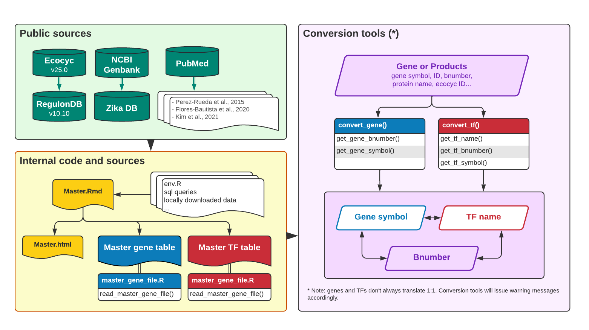
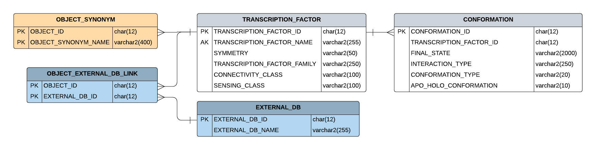
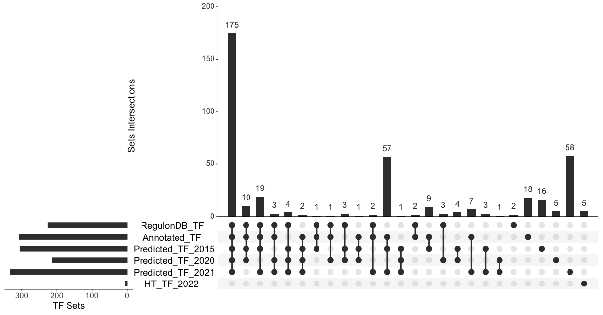
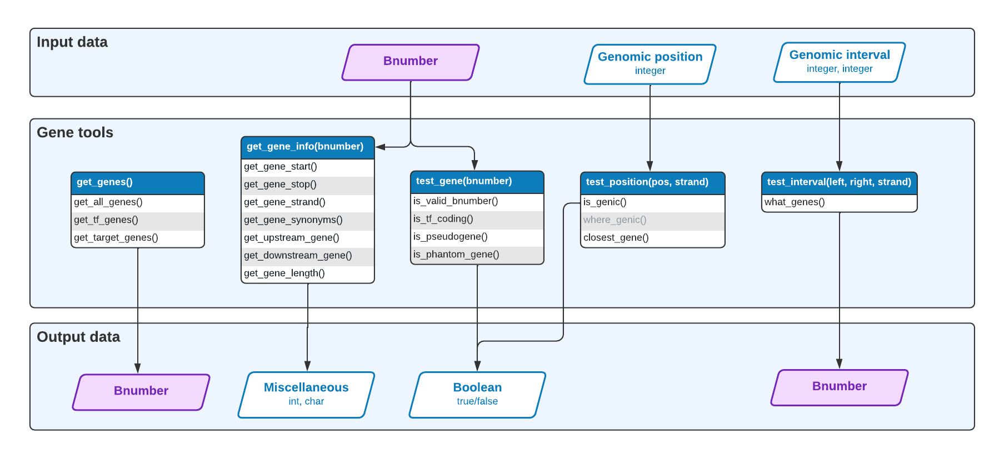
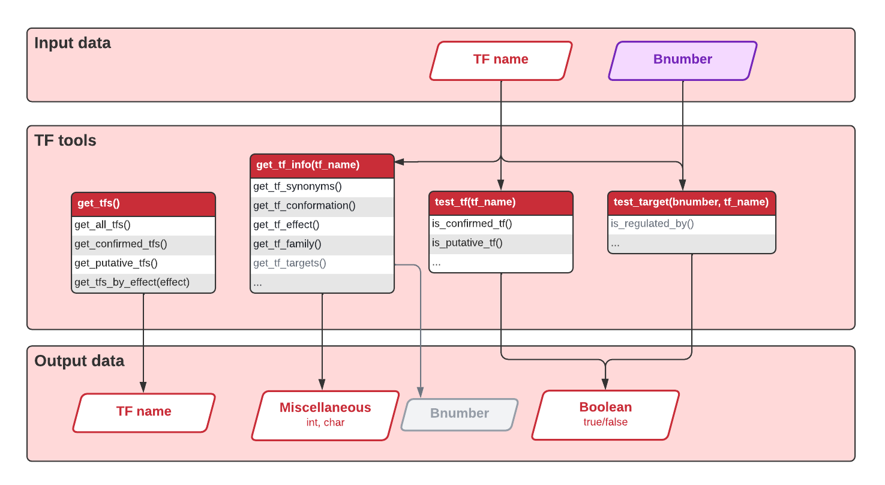

<style type="text/css">

body{ /* Normal  */
      font-size: 14px;
  }
</style>

```{r init, include = FALSE}
setwd("/Users/rioualen/Google Drive/Work/_Git/EcoliGenes/")
date <- Sys.Date()
source(file = "env.r")
```

```{r setup, include = FALSE}
knitr::opts_knit$set(root.dir = "/Users/rioualen/Google Drive/Work/_Git/EcoliGenes/")
knitr::opts_chunk$set(echo = TRUE, include = TRUE, warning = FALSE, message = FALSE, cache = TRUE, eval = FALSE, results = 'asis', fig.width=12, fig.height=6, fig.align = 'center')

```

```{r libs-n-functions}
require(dplyr)
require(DT)
require(ggplot2)
require(readr)
require(RMariaDB)
require(stringr)
require(UpSetR)
require(ComplexUpset)

source(file = "../utils.r")


```

# Introduction


This document reports the details behind the generation of the *E. coli* 'master' gene and TF tables that serves as a basis for the whole library. It aims at being as exhaustive and up-to-date as possible, by querying and merging information from several sources: RegulonDB, Ecocyc, Genbank, and some publications. 



The gene and TF master tables are queried upon executing functions from the R library `EcoliGenes`. It allows to verify and update outdated names or IDs, and extract or manipulate additional gene or TF-related information.

# Master gene table 

## RegulonDB 

```{r gene_query, engine='bash', comment='', eval = TRUE, results = 'markup'}
cat sql/genes.sql
```


```{r query-regulon-genes}
print(paste0("Database scheme: ", regulondb_dbname))

regulondb_access <- RMariaDB::dbConnect(RMariaDB::MariaDB(), username = regulondb_username, password = regulondb_password, dbname = regulondb_dbname, host = regulondb_host, port = regulondb_port)

query_genes <- readr::read_file("sql/genes.sql")

regulon_genes <- RMariaDB::dbGetQuery(regulondb_access, query_genes) %>%
	dplyr::mutate(Ecocyc_id = rm_special_char(Ecocyc_id))  %>% 
	dplyr::mutate(RegulonDB_strand = ifelse(RegulonDB_strand == "reverse", "-", ifelse(RegulonDB_strand == "forward", "+", NA))) %>%
	dplyr::mutate(RegulonDB_TF = ifelse(!is.na(RegulonDB_tf_id), 1 , 0))

RMariaDB::dbDisconnect(regulondb_access)
```

## Zika genesView

From Genbank.

```{r query-zika, eval = FALSE}
zikadb_access <- RMariaDB::dbConnect(RMariaDB::MariaDB(),
																		 username = zika_username,
																		 password = zika_password,
																		 dbname = zika_dbname,
																		 host = zika_host,
																		 port = zika_port)

zika_genes <- RMariaDB::dbGetQuery(zikadb_access, "SELECT * FROM ecoli_project_final.genesView")

RMariaDB::dbDisconnect(zikadb_access)

zika_genes_parsed <- zika_genes %>%
	dplyr::rename(Zika_gene_id = gene_id,
								Zika_bnumber = bnumber,
								Zika_symbol = symbol,
								Zika_product = product,
								Zika_start = start,
								Zika_stop = stop,
								Zika_strand = strand,
								Zika_type = type,
								Zika_essentiality = essentiality,
								Zika_TF = TF
	) %>%
	dplyr::mutate(Zika_parsed_bnum = ifelse(grepl('_', Zika_bnumber), ifelse(grepl('^b', Zika_bnumber), stringr::str_split(Zika_bnumber, '_', simplify = T), Zika_bnumber), Zika_bnumber))

write.table(zika_genes_parsed, file = "inst/extdata/zika_genes.tsv", sep="\t", col.names = T, row.names = F)

```

## Reference set

* Genes are first retrieved from RegulonDB and Zika separately
* Tables are joined using bnumbers (or parsed bnumbers, for sRNA bnumbers in Zika have a specific format)
* Genes that are not merged during this first step are then joined based on their symbol
* Coherency of coordinates and strand is checked
* In case some information differs between RegulonDB and Zika, the priority is given to RegulonDB
* A third join is made based on coordinates identity (couple of remaining cases, with supervision)

* 5 Reference columns are added, following these rules:

  * **Reference_bnumber**: if different, RegulonDB's is kept; if absent, RegulonDB internal ID is kept, else, Zika internal "bnumber" is kept ; synonyms are updated.
  * **Reference_symbol**: if different, RegulonDB's is kept; if absent, RegulonDB bnumber/ID is kept; synonyms are updated. 
  * **Reference_start**: if different (*), RegulonDB's is kept; if absent in RegulonDB, Zika's is used. 
  * **Reference_stop**: if different (*), RegulonDB's is kept; if absent in RegulonDB, Zika's is used. 
  * **Reference_strand**: if different (*), RegulonDB's is kept; if absent in RegulonDB, Zika's is used. 


**(\*) Note**: start, stop and strand *should not* be different, and cases where this happens should be carefully revised.

```{r merge-genes-up-2022}
zika_genes_parsed <- read.table(file = "inst/local_data/zika_genes.tsv", sep="\t", header = T)

## Join RegulonDB and Zika genes on bnumber, then symbol, then coordinates
all_genes <- regulon_genes %>%
	dplyr::mutate_all(dplyr::na_if,"") %>%
	
	## Join RegulonDB and Zika on bnumbers
	dplyr::mutate(Reference_bnumber = ifelse(!is.na(RegulonDB_bnumber), RegulonDB_bnumber, RegulonDB_gene_id)) %>%
	dplyr::full_join(zika_genes_parsed, by = c("Reference_bnumber" = "Zika_parsed_bnum")) %>%
	dplyr::mutate(Reference_symbol = ifelse(((is.na(RegulonDB_symbol)) & (is.na(Zika_symbol))), Reference_bnumber,
																					ifelse(is.na(Zika_symbol), RegulonDB_symbol,
																								 ifelse(is.na(RegulonDB_symbol), Zika_symbol, RegulonDB_symbol)))) %>%
	
	## Join on symbol
	dplyr::group_by(Reference_symbol) %>%
	dplyr::summarise(Reference_bnumber = dplyr::first(Reference_bnumber),
									 dplyr::across(where(is.character), concat_uniq),
									 RegulonDB_start = dplyr::first(RegulonDB_start),
									 RegulonDB_stop = dplyr::first(RegulonDB_stop),
									 RegulonDB_TF = mean(RegulonDB_TF),
									 Zika_gene_id = concat_uniq(Zika_gene_id),
									 Zika_start = dplyr::first(Zika_start),
									 Zika_stop = dplyr::first(Zika_stop),
									 Zika_TF = mean(Zika_TF),
									 gene_synonyms = concat_uniq(gene_synonyms),
									 product_synonyms = concat_uniq(product_synonyms)) %>%
	dplyr::mutate_all(dplyr::na_if,"") %>%
	dplyr::rowwise() %>%
	dplyr::mutate(Reference_start = ifelse(is.na(RegulonDB_start), Zika_start,
																				 ifelse(is.na(Zika_start), RegulonDB_start,
																				 			 ifelse(RegulonDB_start == Zika_start, RegulonDB_start, RegulonDB_start)))) %>%
	dplyr::mutate(Reference_stop = ifelse(is.na(RegulonDB_stop), Zika_stop,
																				ifelse(is.na(Zika_stop),RegulonDB_stop,
																							 ifelse(RegulonDB_stop == Zika_stop,RegulonDB_stop,RegulonDB_stop)))) %>%
	dplyr::mutate(Reference_strand = ifelse(is.na(RegulonDB_strand), Zika_strand,
																					ifelse(is.na(Zika_strand), RegulonDB_strand,
																								 ifelse(RegulonDB_strand == Zika_strand, RegulonDB_strand, RegulonDB_strand))))  %>%
	
	## Join on coordinates and strand
	dplyr::mutate(coords = paste0(Reference_start, "_", Reference_stop, "_", Reference_strand)) %>%
	dplyr::group_by(coords) %>%
	dplyr::summarise(Reference_bnumber = dplyr::first(Reference_bnumber),
									 Reference_symbol = dplyr::first(Reference_symbol),
									 dplyr::across(where(is.factor), concat_uniq),
									 dplyr::across(where(is.character), concat_uniq),
									 dplyr::across(where(is.numeric), min)) %>%
	dplyr::mutate_all(dplyr::na_if,"") %>%
	
	## Group synonyms
	dplyr::rowwise() %>%
	dplyr::mutate(gene_synonyms = concat_uniq2(gene_synonyms, RegulonDB_bnumber, RegulonDB_gene_id, RegulonDB_symbol, Zika_symbol, Zika_bnumber)) %>%
	dplyr::mutate(product_synonyms = concat_uniq2(product_synonyms, RegulonDB_bnumber, RegulonDB_product_id)) %>%
	dplyr::ungroup() %>%
	
	## Order columns and remove missing values
	dplyr::filter(!is.na(Reference_bnumber) & !is.na(Reference_symbol) & !is.na(Reference_start) & !is.na(Reference_stop) & !is.na(Reference_strand)) %>%
	dplyr::select(Reference_bnumber, Reference_symbol, Reference_start, Reference_stop, Reference_strand, contains("RegulonDB"), contains("Zika"),
								gene_synonyms, product_synonyms, everything(), -coords) %>% # Reference_TF
	dplyr::arrange(Reference_start)


```


```{r write-master}
# Check if there's duplicate synonym, eg a gene name or ID that would point to more than one entry
# all_synonyms <- unlist(
# 	lapply(stringr::str_split(all_genes$gene_synonyms, pattern = ","), unique)
# 	)
# 
# sort(all_synonyms[duplicated(all_synonyms)])

master_table  <- all_genes %>% dplyr::select(-RegulonDB_TF, -Zika_TF) %>% as.data.frame()

write.table(master_table, file = "inst/extdata/master_gene_file.tsv", sep="\t", col.names = T, row.names = F)
```

# Master TF table

## RegulonDB TFs




```{r tf_query, engine='bash', comment='', eval = TRUE, results = 'markup'}
cat sql/tfs.sql
```


```{r query-regulon-tfs}
print(paste0("Database scheme: ", regulondb_dbname))

regulondb_access <- RMariaDB::dbConnect(RMariaDB::MariaDB(), 
																				username = regulondb_username,
																				password = regulondb_password,
																				dbname = regulondb_dbname,
																				host = regulondb_host,
																				port = regulondb_port)

query_tfs <- readr::read_file("sql/tfs.sql")

regulon_tfs <- RMariaDB::dbGetQuery(regulondb_access, query_tfs) %>%
	dplyr::left_join(all_genes %>% 
									 	tidyr::separate_rows(RegulonDB_tf_id) %>% 
									 	dplyr::select(Reference_bnumber, Reference_symbol, product_synonyms, RegulonDB_tf_id) %>% 
									 	dplyr::group_by(RegulonDB_tf_id)  %>% 
									 	dplyr::summarise(Reference_bnumber = concat_uniq(Reference_bnumber),
									 									 Reference_symbol = concat_uniq(Reference_symbol),
									 									 product_synonyms = concat_uniq(product_synonyms)),
									 by = "RegulonDB_tf_id") 

RMariaDB::dbDisconnect(regulondb_access)
```

## Other *putative* TFs

From the following sources:

* **RegulonDB-HT**
* Zika DB 
* Genbank
  * Gene products annotated as transcriptional regulators (putative or not)
* TF predictions 
	* Perez-Rueda et al., 2015
	* Flores-Bautista et al., 2020
	* Kim et al., 2021

```{r tf-sources}

## temp, add a few potential TFs from RegulonDB HT datasets
ht_TFs_2022 <- c("dps", "hfq", "kefG", "ygfB")

# old_TFs <- c("MqsA-MqsR")

## Mark genes predicted as potentially TF-coding (Perez-Rueda et al., 2015)
pred2015 <- read.delim("inst/local_data/Perez-Rueda_2015.tsv", header=T, stringsAsFactors = F, comment.char = "#", na.strings = "")

predicted_TFs_2015 <- na.omit(c(pred2015$Gene.Name, pred2015$Locus))


## Mark genes predicted as potentially TF-coding (Flores-Bautista et al., 2020)
pred2020 <- read.delim("inst/local_data/Flores-Bautista_2020.tsv", header=T, stringsAsFactors = F, comment.char = "#", na.strings = "") %>% 
	dplyr::filter(Organism == "Escherichia coli (strain K12)") %>%
	dplyr::select(Entraf, Entry, Gene.names, Entry.name, Regulatory.role) %>%
	dplyr::rowwise() %>% 
	dplyr::mutate(sym = strsplit(Gene.names, split=" ")[[1]][1])

predicted_TFs_2020 <- na.omit(pred2020$sym)

## Notes
## ccdA does not match (associated with H and letA, which point to 2 defferent genes)
## dsdC (duplicate with dsdX, though it looks like an old annotation)

## Mark genes predicted as potentially TF-coding (Kim et al., 2021)

pred2021 <- read.delim("inst/local_data/Kim_2021.tsv", header=T, stringsAsFactors = F, comment.char = "#") 

predicted_TFs_2021 <- pred2021$locus.tag

## Get genes which products are annotated as regulators
tf_patterns <- c("transcriptional regulator", "transcriptional repressor", "transcriptional activator", "transcriptional dual regulator") #"DNA-binding"

all_tfs_genes <- as.data.frame(all_genes)  %>% 
	dplyr::mutate(Annotated_TF = ifelse(grepl(paste(tf_patterns, collapse="|"), RegulonDB_product_name) | grepl(paste(tf_patterns, collapse="|"), product_synonyms) | grepl(paste(tf_patterns, collapse="|"), Zika_product), 1, 0)) %>% 
	dplyr::mutate(Predicted_TF_2015 = ifelse(Reference_symbol %in% predicted_TFs_2015 | Reference_bnumber %in% predicted_TFs_2015, 1, 0))  %>% 
	dplyr::mutate(Predicted_TF_2020 = ifelse(Reference_symbol %in% predicted_TFs_2020 | Reference_bnumber %in% predicted_TFs_2020, 1, 0)) %>%
	dplyr::mutate(Predicted_TF_2021 = ifelse(Reference_symbol %in% predicted_TFs_2021 | Reference_bnumber %in% predicted_TFs_2021, 1, 0)) %>%
	dplyr::mutate(HT_TF_2022 = ifelse(Reference_symbol %in% ht_TFs_2022, 1, 0)) %>%
	dplyr::mutate(TF_score = RegulonDB_TF + Annotated_TF + Predicted_TF_2015 + Predicted_TF_2020 + Predicted_TF_2021 + HT_TF_2022) %>%
	dplyr::filter(TF_score > 0)
## Zika_TF

```

## TF sets overlap

```{r tf-sources-upset, results = 'markup'}

tf_sources <- c("RegulonDB_TF", "Annotated_TF", "Predicted_TF_2015", "Predicted_TF_2020", "Predicted_TF_2021", "HT_TF_2022") 
tf_list <- list()
for (source in tf_sources) {
	tf_list[[source]] <- all_tfs_genes %>% dplyr::filter(get(source) == 1) %>% dplyr::select(Reference_symbol) %>% .$Reference_symbol
}


UpSetR::upset(fromList(tf_list), nsets = 6, number.angles = 0, point.size = 4, line.size = 1, 
    mainbar.y.label = "Sets Intersections", sets.x.label = "TF Sets", 
    text.scale = c(1.7, 1.7, 1.7, 1.7, 2, 2), order.by = "degree",
    keep.order = T, sets = rev(tf_sources))

## complex upset
#----------
tf_sources <- c("Predicted_TF_2021", "Predicted_TF_2020", "Predicted_TF_2015", "Annotated_TF", "RegulonDB_TF") 
tf_list <- list()
for (source in tf_sources) {
	tf_list[[source]] <- all_tfs_genes %>% dplyr::filter(get(source) == 1) %>% dplyr::select(Reference_symbol) %>% .$Reference_symbol
}

#----------
ComplexUpset::upset(fromList(tf_list), 
                    tf_sources,
                    name = "TFs and putative TFs grouped by shared sources",
                    base_annotations = list(
                      'Number of TFs in each group' = ComplexUpset::intersection_size(counts = TRUE, text = list(size = 5))
                    ),
                    set_sizes = upset_set_size() + ylab('Number of TFs per source'),
										# + geom_text(aes(label = ..count..), hjust = 1.1, stat = 'count', size = 5) + expand_limits(y=400),
                    # stripes = c('white', "white", "white", "white", '#eedabb'),
										stripes = ComplexUpset::upset_stripes(
											geom = geom_segment(size = 15),
											colors = c('grey85', "grey95", "grey85", "grey95", '#eedabb')
										),
                    themes = upset_default_themes(text = element_text(size = 16)),
                    width_ratio = 0.3, 
										height_ratio = 0.5, 
										sort_intersections_by = c('degree', 'cardinality'),
										sort_sets=FALSE,
                    queries = list(
                      upset_query(set = 'RegulonDB_TF', fill='#d0b17f')
                      # upset_query(intersect = tf_sources, fill = 'seagreen', color = "seagreen")
                    )
)

```

<!--  -->

```{r tf-merge}
## merge 'official' TFs and other putative TFs
all_tfs <- regulon_tfs %>%
	dplyr::full_join(all_tfs_genes %>% 
									 	dplyr::filter(!is.na(RegulonDB_tf_id)) %>%
									 	dplyr::select(RegulonDB_product_name, RegulonDB_tf_id, Ecocyc_id,
									 								RegulonDB_TF, Zika_TF, Annotated_TF, Predicted_TF_2015, Predicted_TF_2020, Predicted_TF_2021,
									 								gene_synonyms) %>%
									 	tidyr::separate_rows(RegulonDB_tf_id), 
									 by = "RegulonDB_tf_id") %>%
	dplyr::group_by(RegulonDB_tf_id) %>%
	dplyr::summarise(across(where(is.character), concat_uniq), across(where(is.numeric), max)) %>%
	bind_rows(all_tfs_genes %>% 
							dplyr::filter(is.na(RegulonDB_tf_id)) %>%
							dplyr::select(Reference_bnumber, Reference_symbol, gene_synonyms, product_synonyms, RegulonDB_product_name, RegulonDB_tf_id, Ecocyc_id, 
														RegulonDB_TF, Zika_TF, Annotated_TF, Predicted_TF_2015, Predicted_TF_2020, Predicted_TF_2021)) %>%
	dplyr::mutate(Reference_name = ifelse(!is.na(RegulonDB_tf_name), RegulonDB_tf_name, Reference_symbol)) %>%
	dplyr::select(Reference_name, Reference_bnumber, Reference_symbol, everything()) %>%
	dplyr::rowwise() %>%
	dplyr::mutate(TF_synonyms = concat_uniq2(Reference_name, Reference_bnumber, Reference_symbol, Uniprot_ID, Refseq_ID, Ecocyc_id, RegulonDB_product_name, RegulonDB_tf_conformation_final_state, product_synonyms, gene_synonyms, capitalize(Reference_symbol))) %>%
	dplyr::mutate(Zika_TF = ifelse(is.na(Zika_TF), 0, Zika_TF)) %>%
	dplyr::arrange(Reference_name)

```


```{r tf-master-dt}
display_tf <- all_tfs %>%
	dplyr::select(contains("Reference"), contains("_TF"), TF_synonyms)

DT2 <- DT::datatable(display_tf, rownames= FALSE, options = list(searching = FALSE, pageLength = 15))
DT2

# DT1 <- DT::datatable(ht_tu_metadata, options = list(dom = '', pageLength = 20, autoWidth = TRUE, columnDefs = list(list(width = '200px', targets = c(3, 4)))))

```

```{r tf-master-write}
# Check duplicate synonyms, eg a  name or ID that would point to more than one entry
all_synonyms <- unlist(
	lapply(stringr::str_split(all_tfs$TF_synonyms, pattern = ","), unique)
	)

sort(all_synonyms[duplicated(all_synonyms)])

## Manually added synonyms that are not yet in RegulonDB
Reference_name <- c("GatR", "YdfH", "ydhB")
add_synonyms <- c("GatR-2", "RspR", "PunR")
manual_synonyms <- data.frame(Reference_name, add_synonyms)


master_tf <- all_tfs %>%
	dplyr::left_join(manual_synonyms, by = ("Reference_name")) %>%
  dplyr::rowwise() %>%
  dplyr::mutate(TF_synonyms = concat_uniq2(TF_synonyms, add_synonyms)) %>%
	dplyr::select(-add_synonyms, -Zika_TF)

write.table(master_tf, file = "inst/extdata/master_tf_file.tsv", sep="\t", col.names = T, row.names = F)

```

## Tools





<!-- ## Other -->

<!-- Uniprot downloads 22-03-23 -->

<!-- https://www.uniprot.org/uniprot/?query=reviewed:no%20taxonomy:511145 -->
<!-- https://www.uniprot.org/uniprot/?query=reviewed:no%20taxonomy:83333 -->


## [Deprecated]

```{r map-coords}

# all_coords_list <- list()
# all_coords_df <- data.frame(v2 = c(), v3 = c())
# 
# for (i in 0:9) {
# 	# start <- i * 500000
# 	# stop <- (i+1) * 500000
# 	# df <- data.frame(v2 = start:stop)
# 	# write.table(df, file = paste0("~/Desktop/map-coords", i, ".tsv"), sep="\t", col.names = T, row.names = F)
# 	df  <-	read.table(file = paste0("~/Desktop/map-coords", i, ".tsv"), header = T)
# 	# print(summary(df))
# 
# 	all_coords_df <- rbind.data.frame(all_coords_df, df)
# }
# 
# all_coords_df <- all_coords_df %>% 
# 	dplyr::filter(v2 <= 4639675 & v3 <= 4641652) %>%
# 	dplyr::distinct()
# 
# # write.table(df, file = paste0("~/Desktop/map-coords", i, ".tsv"), sep="\t", col.names = T, row.names = F)
# write.table(all_coords_df, file = "inst/extdata/map-coords.tsv", sep="\t", col.names = T, row.names = F)

```

```{r ecocyc-stuff}
#Genes and proteins exported as SmartTables on 2022/02/02 from the website.
#TFs exported as SmartTables on 2022/03/14 from the website.

# ecocyc_genes <- read.delim("inst/extdata/ecocyc_genes_smarttable.tsv", header = T,  sep = "\t",  comment.char = "#", na.strings = "") %>%
# 		dplyr::mutate(Left.End.Position = as.numeric(Left.End.Position),	Right.End.Position = as.numeric(Right.End.Position)) 
# 
# ecocyc_products <- read.delim("inst/extdata/ecocyc_proteins_smarttable.tsv", header = T,  sep = "\t",  comment.char = "#", na.strings = "") %>%
# 	dplyr::left_join(read.delim("inst/extdata/ecocyc_tfs_smarttable.tsv", header = T,  sep = "\t",  comment.char = "#", na.strings = ""), by = "Proteins" )

## Check coherency b/w RegulonDB and Ecocyc
# genes_regulon_ecocyc <- regulon_genes %>%
# 	dplyr::full_join(ecocyc_genes, by = c("Ecocyc_id" = "Gene.Name"))
 # write.table(genes_regulon_ecocyc, file = "~/Desktop/TEMP_regu_ecocyc_genes_10_10.tsv", col.names = T,  row.names = F, quote = F, sep = "\t")

```

```{r manual-synonyms}

## old, manually added exceptions -- many due to delay in RegulonDB releases -- to be revised and deleted later

# %>%
#   mutate_at("RegulonDB_symbol", ~replace(., RegulonDB_bnumber == 'b4708', 'ECK125240991')) 
# ### Changed manually, since there's 2 genes with the same RegulonDB_symbol and we don't want them to be merged


## Manually added synonyms (not added as of March 14th, to revise later tomando en cuenta nuevas actualizaciones de Ecocyc)
## raiZ/b4805, C0293/b4806
## istR-1/istR
## TODO efeU_1 efeU
## TODO ilvG_1 ilvG
## insAB-5 check ecocyc should be in there?b ybeM_1 ychG_1 dpaA
# Reference_symbol <- c("gatR", "insO", "istR", "yagP", "ydfJ", "ydiU", "yjhB", "ydgV", "yhjC", "yejM", "yhcH",  "yeeX", "ygeR", "yedR", "yraP", "yddW", "yhcB", "yafK", "ytfL", "yebS", "yjhC")
# add_synonyms <- c("gatR_2", "insN-2", "istR-1", "b4694", "b4600", "selO", "nanX", "mdtU", "rcdB", "lapC", "nanQ", "tmaR", "actS", "drpB", "dolP", "digH", "zapG", "dpaA", "paeA", "letA", "nanY")
# manual_synonyms <- data.frame(Reference_symbol, add_synonyms)

#Note the pseudogene "insI2" has its symbol changed for its RegulonDB ID, for there is another gene that shares the same symbol, but a distinct bnumber.


  # ## Add synonyms
  # dplyr::left_join(manual_synonyms, by = ("Reference_symbol")) %>%
  # dplyr::rowwise() %>%
  # dplyr::mutate(gene_synonyms = concat_uniq2(gene_synonyms, RegulonDB_bnumber, RegulonDB_gene_id, RegulonDB_symbol, Zika_symbol, Zika_bnumber, add_synonyms)) %>%
  # dplyr::mutate(gene_synonyms = concat_uniq2(gene_synonyms, RegulonDB_bnumber, RegulonDB_gene_id, RegulonDB_symbol, Zika_symbol, Zika_bnumber)) %>%
	## Order columns and remove missing values
	# dplyr::ungroup() %>%
	# dplyr::filter(!is.na(Reference_bnumber) & !is.na(Reference_symbol) & !is.na(Reference_start) & !is.na(Reference_stop) & !is.na(Reference_strand) & !is.na(Reference_TF)) %>%
	# dplyr::select(Reference_bnumber, Reference_symbol, Reference_start, Reference_stop, Reference_strand, Reference_TF,
	#   							gene_synonyms, product_synonyms, everything(), -coords, -add_synonyms) %>%
	# dplyr::select(Reference_bnumber, Reference_symbol, Reference_start, Reference_stop, Reference_strand, Reference_TF,
	#   							gene_synonyms, product_synonyms, everything(), -coords) %>%
	# dplyr::arrange(Reference_start)


# write.table(all_genes, file = "TEMP_MASTER_GENE_FILE.tsv", col.names = T,  row.names = F, quote = F, sep = "\t")

## Check if there are genes without consensus info // should not, if so, go back and fix it
# all_genes %>% dplyr::filter(is.na(Reference_bnumber)|is.na(Reference_symbol)|is.na(Reference_start)|is.na(Reference_stop))
```

