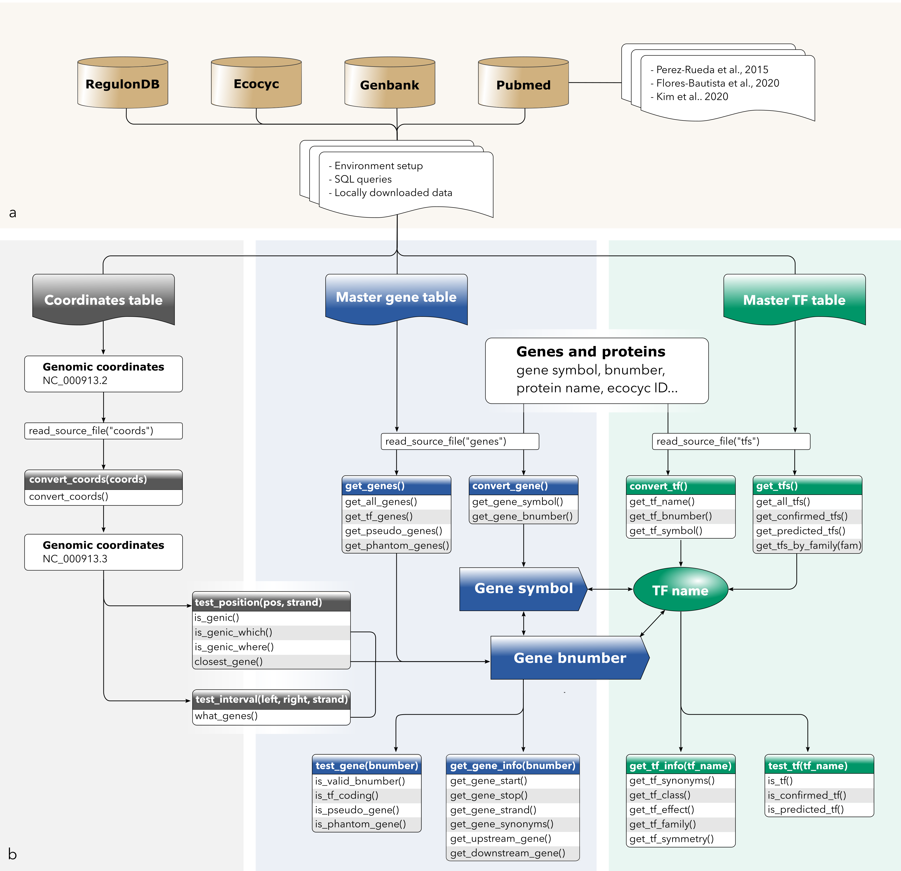

# EcoliGenes

<!-- badges: start -->
<!-- badges: end -->

Despite a wide knowledge of the E. coli K-12 genome and regulatory network, the computational manipulation of numerous datasets from a variety of sources can prove to be rather fastidious, due to a lack of congruence in the conception of biological objects, as well as their names or identifiers. Genes and products can be referred to using a variety of names and synonyms, obsolete or not, bnumbers and coordinates can change over time due to the addition of new knowledge, and frequent updates in genome annotations can lead to discrepancies between sources. Additionally, a significant amount of published datasets are based on obsolete genome assemblies, leading to erroneous genomic coordinates.

In order to overcome these limitations and process datasets containing any information on E. coli genes, TUs, promoters, or any other genomic features associated with coordinates, I  gathered comprehensive information into one single place and created “EcoliGenes”, a library to perform verifications and homogenization of datasets.

## Framework

### a. Source data

* **Genes**

I first retrieved genes and their products from RegulonDB, and completed this information with additional data extracted from Ecocyc and Genbank. I merged them first on the basis of their bnumbers, and then using their symbols and coordinates. Finally, I added “reference” columns to this master table: reference bnumber, reference symbol, reference start, reference stop, reference strand; and “synonym” columns to store additional names from any source: gene synonyms and product synonyms. 

* **TFs**

To date, there is no single consensual list of confirmed TFs for E. coli. RegulonDB contains 222 “confirmed” TFs, associated with at least one regulatory interaction, however the total number of TFs in E. coli is estimated to be around 300. Other groups have proposed TF candidates based on other criteria such as the presence of a DNA binding domain or a significant homology with known TFs. First I retrieved the information available in RegulonDB, then added gene products annotated as transcriptional regulators (putative or not) in Genbank, as well a TF predictions from recent publications (Perez-Rueda et al., 2015; Flores-Bautista et al., 2020; Kim et al., 2020). I added their respective identifiers from external databases such as Uniprot, RefSeq, and Pfam, other existing synonyms, and the following “reference” columns: reference TF name, reference gene symbol, reference gene bnumber. 

### b. Functions

The available functions can be divided into three categories:

* **Coordinates-based tools** (gray-headed boxes) 

The convert_coords function allows to convert genomics coordinates based on E. coli genome version NC_000913.2 to the currently used genome version NC_000913.3. The functions test_position and test_interval perform the extraction of information related to specific genomic positions or regions.

* **Gene-based tools** (blue-headed boxes)

Genes reported as symbols or identifiers from any source can be readily converted to symbols or bnumbers of reference with the convert_gene function. The get_genes functions allow retrieving a list of genes’ bnumbers given a specific criteria. Then, bnumbers can be used to perform boolean tests using test_gene, or retrieve specific attributes of the genes with get_gene_info.

* **TF-based tools** (green-headed boxes)

Transcription factors reported as protein names, gene symbols or any other identifiers are converted to their names of reference using convert_tf. The get_tfs functions allow retrieving a list of TF reference names given specific criteria. Then, they can be used to perform boolean tests using test_tf, or retrieve specific attributes of the TF with get_tf_info.

## How to cite:

Rioualen C. The EcoliGenes library Solving the never-ending struggle with Escherichia coli K-12 genes [version 1; not peer reviewed]. F1000Research 2022, 11:810 (poster) (https://doi.org/10.7490/f1000research.1119040.1)

