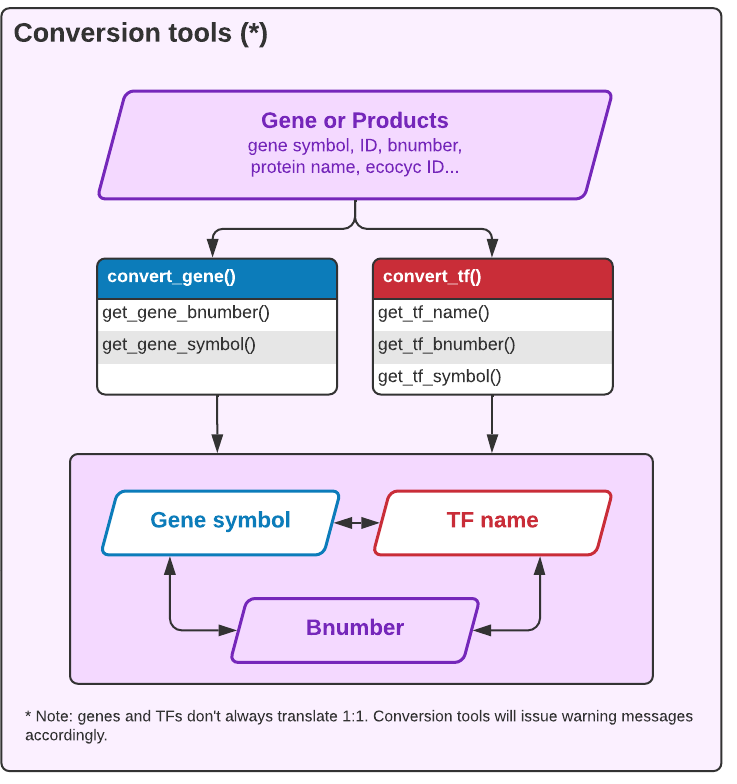

# EcoliGenes

<!-- badges: start -->
<!-- badges: end -->

The goal of EcoliGenes is to perform verifications and conversions of gene symbols and bnumbers. Indeed, we have noticed a number of discrepancies between the annotations in different databases of reference such as [RegulonDB](http://regulondb.ccg.unam.mx), [Ecocyc](https://ecocyc.org/), or [GenBank](https://www.ncbi.nlm.nih.gov/genbank/). We use an internal file with up-to-date gene symbols and bnumbers, as well as lists of synonyms commonly found accross databases, in order to uniformize gene sets for downstream treatments. 

## Tools




## Installation

``` r
# remotes::install_github("rioualen/EcoliGenes")

# For now, download and sourc:
devtools::load_all("<path_to_download_dir>/EcoliGenes")

```

 
## Example

A few basic examples of the functions currently available. The functions are vectorized, so they can be applied to a single character variable, a vector, or a dataframe column: the output has the same size as the input. 

``` r
library(EcoliGenes)

## to do

```


